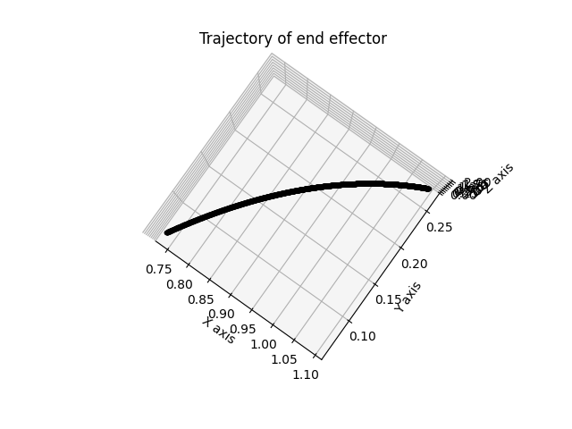
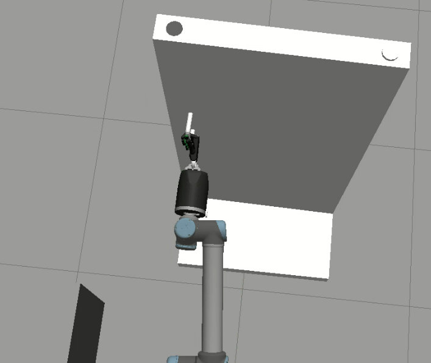
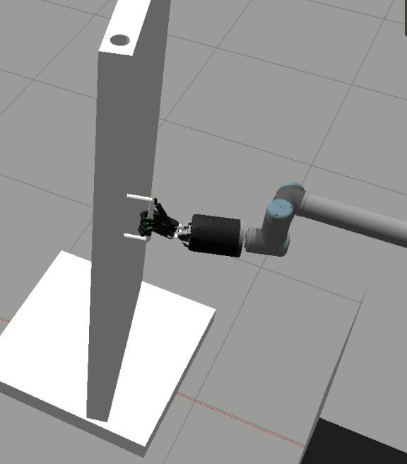

# Dexterous Manipulator

This project consists of the a UR10 manipulator which opens a door using forwad and inverse kinematics. 

# Dependencies to build the project
 * ROS Melodic on Ubuntu 18.04
 * [Docker](https://docs.docker.com/get-docker/)
 * NVidia Graphic Drivers installed on your local system
 * [Docker Nvidia](https://docs.nvidia.com/datacenter/cloud-native/container-toolkit/install-guide.html)
 * CMake
 * Sympy
# How to build the project
```
Open Terminal

xhost +

xhost local:root

Download the docker image file from 

docker build project2.Dockerfile

docker run -d -it --name ShadowContainer -e interface=eht1 -e DISPLAY=$DISPLAY -e LOCAL_USER_ID=1000 -v /tmp/.X11-unix:/tmp/.X11-unix:rw -v ~/Documents/Projects/ShadowProject/shadowhand:/home/user/workspace/src/shadowhand:rw -v ~/Documents/Projects/ShadowProject/shadowlibs:/home/user/workspace/src/shadowlibs:rw -v ~/Documents/Projects/ShadowProject/project2:/home/user/workspace/src/project2:rw --security-opt seccomp=unconfined --network=host --pid=host --gpus all --privileged --device=/dev:/dev --runtime=nvidia shadow_image:latest

sudo docker exec -u user -it ShadowContainer /bin/bash

roscd sr_config

git checkout shadowrobot_170911

rm -rf $(rospack find sr_cyberglove_config)

cd ~/workspace

catkin_make

source devel/setup.bash

roscd shadowhand

cd custom

# Copy only the `shadowhand.world` file and the `sr_right_ur10arm_hand.launch` files.
./custom_files_setup.py # press 0 and 2
```

# How to run the project
```
#To run the simulation
#Open 3 terminals
#Go to your workspace and source in all the 3 terminals 
roslaunch shadow_arm door_opener.launch
rosrun shadow_arm starter.py
rosrun shadow_arm grasper.py
rosrun shadow_arm arm_initializer.py

```

# Results
<h2> Trajectory Obtained by Inverse Kinematics</h2>
<p align="center">
  
</p>

<h2> Grasping the door</h2>
<p align="center">
  
</p>
<h2>Opening the door</h2>
<p align="center">
  
</p>


# References & Some important topics for debugging

 * [Shadow Hand Documentation](https://dexterous-hand.readthedocs.io/en/latest/user_guide/3_software_description.html#writing-controllers)

 * [Shadow Hand Documentation 2](https://buildmedia.readthedocs.org/media/pdf/dexterous-hand/fsrc-2786_documentation/dexterous-hand.pdf) #Page 44
